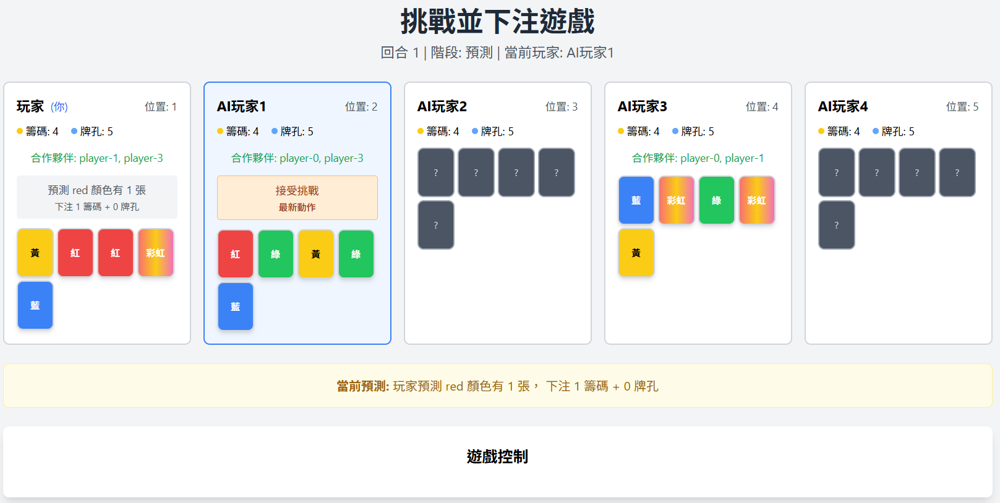

# 挑戰並下注遊戲



## 遊戲簡介

挑戰並下注是一個策略性卡牌遊戲，玩家需要預測所有玩家中某個顏色的卡牌數量並下注，其他玩家可以選擇接受或挑戰。

## 遊戲規則

### 基本設定
- **玩家數量**: 5位玩家
- **卡牌**: 6種顏色（紅、黃、綠、藍、紫、彩虹），每種10張，共60張
- **初始資源**: 每位玩家5個牌孔、4個籌碼

### 遊戲流程

1. **發牌階段**: 每位玩家根據牌孔數量獲得手牌
2. **預測階段**: 輪到的玩家預測某個顏色的卡牌總數量
3. **挑戰階段**: 下一位玩家選擇接受或挑戰預測
4. **下注階段**: 如果選擇挑戰，雙方進行下注對決
5. **結算階段**: 揭示所有手牌，判斷預測是否成功

### 特殊規則

- **彩虹卡**: 計入所有顏色
- **資源交換**: 籌碼與牌孔可1:1交換，但牌孔最多5個
- **回合懲罰**: 15回合起每5回合失去1個籌碼（或牌孔）
- **勝利條件**: 遊戲持續到只剩3位玩家

## 技術實作

### 技術棧
- **前端**: React 18 + TypeScript
- **樣式**: Tailwind CSS
- **AI**: OpenAI GPT-3.5 Turbo（可選）
- **狀態管理**: React Hooks

### 架構特點
- 純前端應用，無需後端服務器
- 單人+AI模式，支援合作團隊
- 智能AI決策引擎，包含備用邏輯
- 響應式設計，支援多種設備

## 安裝和運行

### 1. 安裝依賴
```bash
npm install
```

### 2. 配置環境變數（可選）
複製 `.env.example` 為 `.env` 並填入您的 AI API 配置：
```bash
cp .env.example .env
```

編輯 `.env` 文件：
```
REACT_APP_API_KEY=your_api_key_here
REACT_APP_BASE_URL=https://api.openai.com/v1
REACT_APP_MODEL=gpt-3.5-turbo
```

**配置說明：**
- `REACT_APP_API_KEY`: 您的AI API金鑰（必填）
- `REACT_APP_BASE_URL`: API基礎URL（可選，默認為OpenAI）
- `REACT_APP_MODEL`: 使用的模型（可選，默認為gpt-3.5-turbo）

> **注意**: AI API 配置是可選的。如果不提供，遊戲會使用內建的備用AI邏輯。此配置支援OpenAI及其他相容的API服務。

### 3. 啟動開發服務器
```bash
npm start
```

遊戲將在 http://localhost:3000 開啟。

### 4. 建構生產版本
```bash
npm run build
```

## 遊戲特色

### 🎮 遊戲玩法
- **策略預測**: 根據可見卡牌預測總數量
- **合作模式**: 與AI玩家組隊，共享手牌資訊
- **風險管理**: 平衡進攻和防守策略
- **資源管理**: 籌碼與牌孔的靈活運用

### 🤖 AI系統
- **智能決策**: 基於遊戲狀況做出合理決策
- **團隊協作**: AI會考慮合作夥伴的手牌
- **難度平衡**: 提供有挑戰性但公平的對手
- **備用邏輯**: 即使沒有API也能正常運行

### 💻 用戶體驗
- **直觀界面**: 清晰的卡牌顯示和操作按鈕
- **即時反饋**: 遊戲日誌記錄所有動作
- **響應式設計**: 適配桌面和行動設備
- **無需安裝**: 瀏覽器即可遊玩

## 文件結構

```
src/
├── components/          # React組件
│   ├── Game.tsx        # 主遊戲組件
│   ├── GameSetup.tsx   # 遊戲設置
│   ├── GameControls.tsx # 遊戲控制界面
│   ├── PlayerComponent.tsx # 玩家顯示組件
│   └── CardComponent.tsx # 卡牌組件
├── hooks/              # React Hooks
│   └── useGameLogic.ts # 遊戲邏輯Hook
├── types/              # TypeScript類型定義
│   └── game.ts         # 遊戲相關類型
├── utils/              # 工具函數
│   ├── gameLogic.ts    # 遊戲邏輯函數
│   └── aiEngine.ts     # AI決策引擎
└── App.tsx             # 應用程式入口
```

## 開發說明

### 添加新功能
1. 在 `types/game.ts` 中定義新的類型
2. 在 `utils/gameLogic.ts` 中實作邏輯函數
3. 在 `hooks/useGameLogic.ts` 中添加狀態管理
4. 在組件中使用新功能

### AI邏輯調整
- 修改 `utils/aiEngine.ts` 中的決策邏輯
- 調整提示詞以改善AI行為
- 測試備用邏輯的有效性

## 免責聲明
本專案95%以上程式碼由AI生成，僅作測試使用。

## 授權

此專案僅供學習和娛樂用途。
